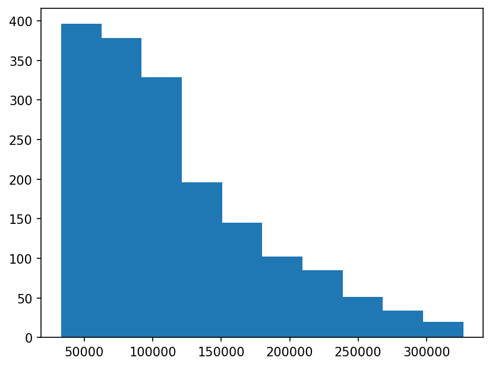
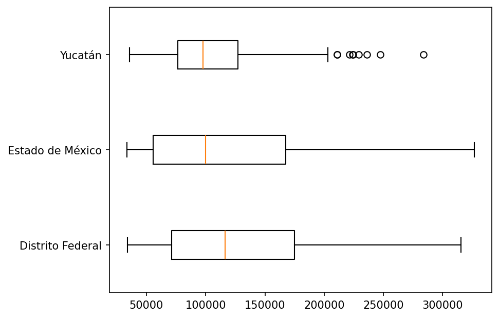
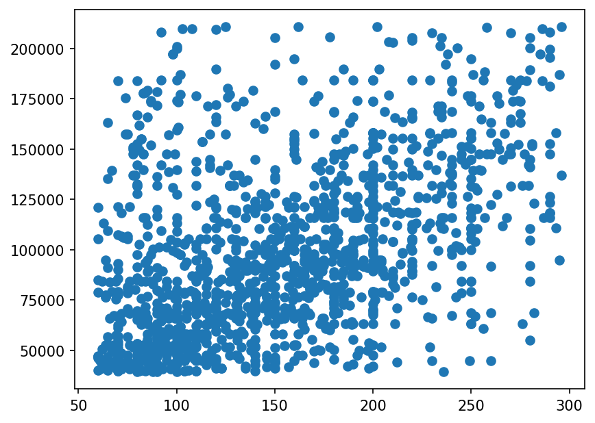
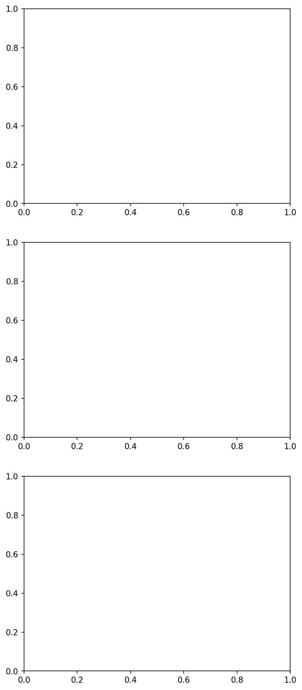
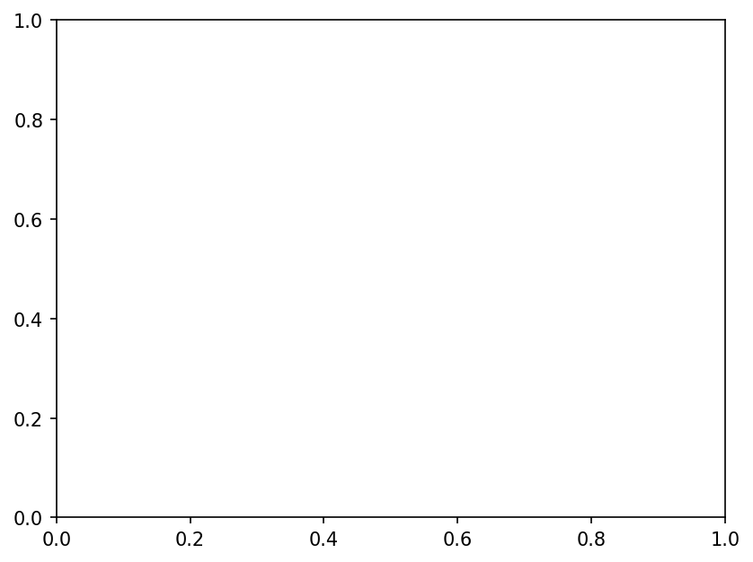

# 🏠 Mexico Real Estate Analysis

> **Research Question:** Are property prices in Mexico more influenced 
> by property size or by location?

## Overview
An end-to-end exploratory data analysis of **1,736 Mexican property 
listings** using Python. This project covers the full data science 
pipeline — from raw messy data to cleaned, visualized, and correlated 
insights — to answer a real-world question about what drives property 
prices in Mexico.

---

## Key Findings

- 📍 **Location matters more than size.** While size and price have a 
  moderate positive correlation (r = 0.59), this relationship varies 
  dramatically by state.

- 💰 **Distrito Federal commands the highest prices** with the widest 
  price range — reflecting a highly diverse urban market.

- 📊 **Size predicts price better in some states than others.** In 
  Yucatán the relationship is strong and consistent. In Distrito Federal 
  it is nearly flat — location within the city matters far more than 
  raw size.

- 🔍 **Simpson's Paradox confirmed.** The national correlation of 0.59 
  between size and price hides dramatically different state-level 
  relationships — proving that aggregate numbers can be misleading.

- 📐 **Larger properties are cheaper per m²** — small apartments 
  command a premium per square meter compared to larger houses.

---

## Project Structure
mexico-real-estate-analysis/

│

├── data/

│   ├── mexico-real-estate-1.csv          # Raw file 1

│   ├── mexico-real-estate-2.csv          # Raw file 2

│   ├── mexico-real-estate-3.csv          # Raw file 3

│   └── mexico-real-estate-combined-clean.csv  # Final clean dataset

│

├── notebooks/

│   ├── 01_data_cleaning.ipynb            # Loading, cleaning, combining

│   ├── 02_visualization.ipynb            # Histograms, boxplots, scatterplots

│   └── 03_correlation.ipynb              # Correlation analysis, heatmap

│

├── images/                               # Saved plots

├── README.md

└── requirements.txt

---

## Visualizations

### Price Distribution

> Property prices are strongly right-skewed. Most properties are priced 
> between $30,000–$130,000 but a few luxury properties extend the tail 
> to $300,000+. The median ($97,000) is more representative than the 
> mean ($115,000).

---

### Price by State (Top 3)

> Location drives significant price differences. Distrito Federal has 
> the highest median price and widest spread. Yucatán is the most 
> affordable and consistent market.

---

### Area vs Price (Cleaned)

> After removing the bottom 5% and top 10% of outliers, a clear 
> positive relationship emerges between size and price — but with 
> significant scatter, suggesting other factors like location also matter.

---

### Area vs Price with Trendline

> The regression line confirms a positive relationship. Each additional 
> m² adds roughly $700 to the price on average. The wide confidence 
> band at larger sizes indicates less certainty for large properties.

---

### Size-Price Relationship by State (Small Multiples)

> The most important finding: the size-price relationship looks 
> completely different across states. In Yucatán size strongly predicts 
> price. In Distrito Federal the line is nearly flat — neighbourhood 
> and location within the city matter far more than raw size.

---

### Correlation Heatmap

> Area and price have the strongest correlation (r = 0.59) among all 
> numerical variables. Latitude and longitude show weaker relationships 
> with price.

---

### Price Per m²

> Larger properties are cheaper per square meter — small apartments 
> command a significant premium per m² compared to larger houses.

---

## Analysis Pipeline

Raw Data (3 CSV files)

↓

Data Cleaning & Combining    [01_data_cleaning.ipynb]

Remove nulls
Fix data types
Convert currencies
Extract lat/lon
Combine into one dataset

↓

Exploratory Visualization    [02_visualization.ipynb]
Histograms — distribution shape
Boxplots — group comparisons
Scatterplots — size vs price
Small multiples — by location

↓

Correlation Analysis         [03_correlation.ipynb]
Pearson correlation
Correlation heatmap
Segmented by state
Segmented by property type
Feature engineering (price per m²)

↓

Conclusion
Location influences price more than size
Simpson's Paradox confirmed